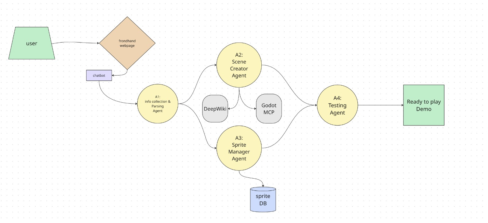

# GotiAI: Autonomous Multi AI-Agents Godot 4 Game Generation

## 🚀 The Vision
GotiAI is a multi-agent orchestration framework designed to transform natural language prompts into fully functional, playable Godot 4 games. Built during a high-stakes hackathon, our goal was to bridge the "Dev Void" between creative intent and technical implementation in the Godot Engine.

## ⚠️ The Problem: The ".tscn" Dev Void
The biggest hurdle in AI-driven game development for Godot is the **`.tscn` (Scene) file format**. 
* **Fragility**: Scene files rely on complex, relational ID mapping for resources and nodes.
* **Corruptibility**: Standard LLMs struggle to maintain internal ID consistency, leading to "Broken Scene" errors that prevent Godot from even opening the project.
* **The Void**: While AI can write snippets of code, generating a cohesive, multi-node game environment with working assets usually requires manual human intervention.

## 🛠 Our Solution: Multi-Agent Orchestration
GotiAI solves this by deploying a specialized team of AI agents, choreographed via **LangGraph**, to handle different stages of the development lifecycle.

### The Agent Loop (A1-A4)

| Agent | Role | Responsibility |
| :--- | :--- | :--- |
| **A1: The Architect** | Planner | Analyzes user prompts to select the best "Kit" (Space Shooter vs. Platformer) and generates a detailed Game Design Document. |
| **A3: The Quartermaster** | Asset Manager | Injects high-quality asset kits and generates a `SpriteLoader` helper script to prevent resource path hallucinations. |
| **A2: The Lead Dev** | Coder | Generates the core GDScript logic. It uses a **"Code-as-Scene"** approach, building the node tree dynamically at runtime to bypass `.tscn` corruption. |
| **A4: The QA Lead** | Tester | Runs compilation checks, identifies syntax errors, and performs self-healing patches before delivery. |

## 🧠 Key Technical Aspects

### 1. Dynamic Scene Construction
Instead of fighting the `.tscn` parser, GotiAI's **Coder Agent (A2)** utilizes a runtime node construction pattern. By using `.new()` and `add_child()` in GDScript, we ensure the game is syntactically valid and the scene tree is constructed perfectly every time, without relying on fragile scene files.

### 2. Asset Injection & SpriteLoader
The **Asset Manager (A3)** provides a standardized API for the coder. Instead of guessing paths, A2 uses:
- `SpriteLoader.load_texture(node, "alien.png")`
- `SpriteLoader.setup_animations(node, "player")`
This decoupling ensures that art and code are always synchronized.

### 3. Self-Healing QA
Our **Tester Agent (A4)** monitors the Godot output. If a compilation error occurs, it identifies the failing line and applies a local patch, ensuring the "Demo" delivered to the user is functional.

## 💻 Tech Stack
* **Game Engine**: Godot 4.x
* **Orchestration**: LangGraph / LangChain
* **LLMs**: GPT-4o / Claude 3.5 Sonnet
* **Tools**: Python, GDScript, Godot MCP (Model Context Protocol)

## ⏩ Getting Started
1. Clone the repository.
2. Define your game idea in the `orchestrator.py` input.
3. Run the pipeline: `python orchestrator.py`
4. Open the generated project in Godot 4 and hit **Play**.

---

*Developed by Eyal Levy and Team for the GO.AI Hackathon 2026.*
